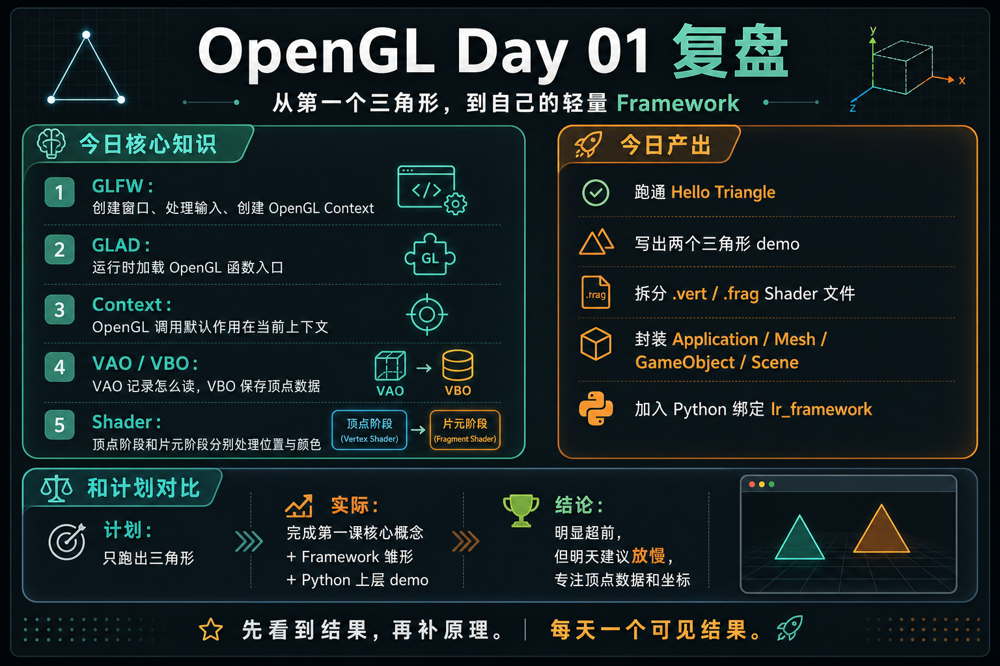
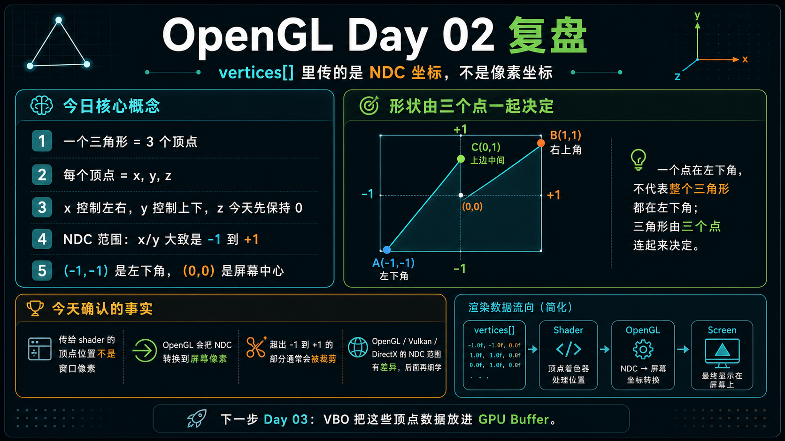
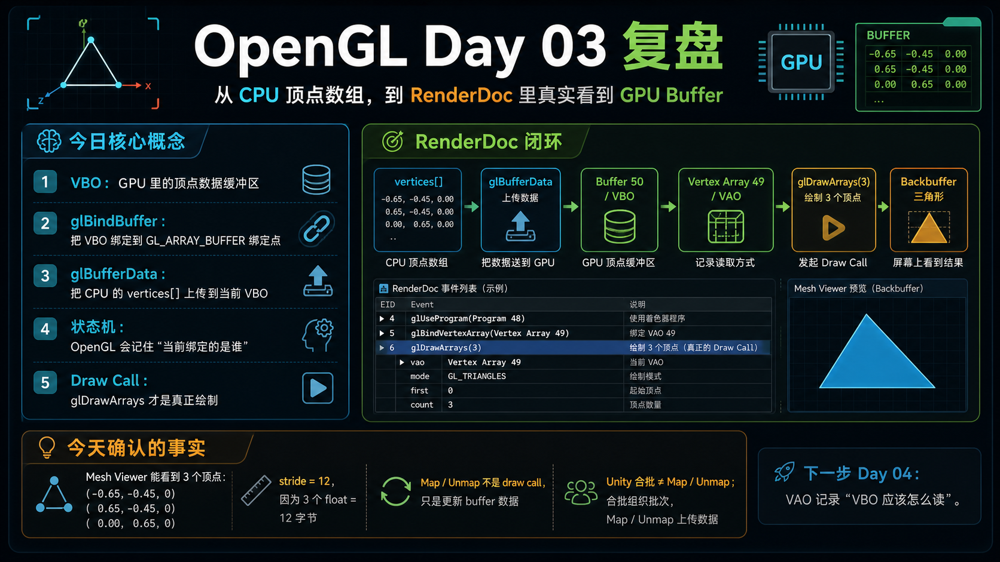

# 学习复盘

这里记录每天的学习复盘。复盘会尽量包含三件事：

- 今天学到的核心知识点。
- 和原计划相比的进度判断。
- 一张适合保存的学习卡片、脑图或流程图。

## 2026-05-12：OpenGL Day 01

### 今日核心知识

- GLFW：负责创建窗口、处理输入、创建 OpenGL Context。
- GLAD：负责运行时加载当前环境里的 OpenGL 函数入口。
- Context：OpenGL 调用默认作用在当前线程绑定的上下文上。
- VAO / VBO：VBO 保存顶点数据，VAO 保存顶点数据的读取规则。
- Shader：顶点着色器处理顶点，片元着色器处理像素颜色。

### 今日产出

- 跑通 LearnOpenGL 第一课 Hello Triangle。
- 写出两个三角形 demo。
- 把顶点 shader 和片元 shader 拆成独立文件。
- 建立轻量 `Framework`，封装 `Application`、`Mesh`、`GameObject`、`Scene` 等概念。
- 加入 Python 绑定 `lr_framework`，为后续用 Python 写上层 demo 留出入口。

### 和计划对比

原计划第 01 天只是跑出三角形。今天实际完成了第一课核心概念梳理、多个 demo、轻量 Framework 雏形和 Python 上层绑定，进度明显超前。

下一步建议放慢一点：第 02 天专注顶点数据、坐标顺序和形状变化，让封装背后的基础概念更稳。

## 2026-05-13：OpenGL Day 02

### 今日核心知识

- 一个三角形由 3 个顶点决定。
- 每个顶点当前写成 `x, y, z` 三个数字。
- `vertices[]` 里传给 shader 的不是窗口像素坐标，而是 NDC 坐标。
- OpenGL 第一课里，`x/y` 大致在 `-1` 到 `+1` 范围内：`(-1, -1)` 是左下角，`(0, 0)` 是屏幕中心。
- 一个点在左下角，不代表整个三角形都在左下角；三角形的位置和形状由三个点一起决定。

### 今日产出

- 建立 [02 Vertex Data](../../demos/02_vertex_data/README.md) 独立工程。
- 通过改顶点坐标观察三角形形状变化。
- 明确记住：当前传的是 NDC 坐标，不是像素坐标。
- 整理了 OpenGL / Vulkan / DirectX 的 NDC 差异图，作为后续跨平台渲染复习资料。

### 和计划对比

原计划第 02 天只理解顶点数据。今天完成了顶点坐标、NDC、坐标边界和平台差异的初步整理，进度略超前。

下一步 Day 03 适合专门学 VBO：把这些顶点数据放进 GPU Buffer。

## 2026-05-14：OpenGL Day 03

### 今日核心知识

- VBO 是 GPU 里的顶点数据缓冲区。
- `vertices[]` 在 CPU 内存里，`glBufferData` 把它复制到当前绑定的 VBO。
- OpenGL 是状态机风格：`glBindBuffer` 先选择当前对象，后续 API 通过绑定点找到它。
- `GL_ARRAY_BUFFER` 是绑定点，同一时刻只能绑定一个当前 VBO。
- `glDrawArrays` 才是真正的 draw call；`Map / Unmap`、`glBufferData`、`glUniform*` 都只是更新数据或状态。

### 今日产出

- 建立 [03 VBO](../../demos/03_vbo/README.md) 独立工程。
- 用 RenderDoc 在 Windows 上成功抓到 `glDrawArrays(3)`。
- 在 RenderDoc 里确认 `Buffer 50` 对应 VBO，`Vertex Array 49` 对应 VAO。
- 在 Mesh Viewer 里看到实际顶点：`(-0.65, -0.45, 0)`、`(0.65, -0.45, 0)`、`(0, 0.65, 0)`。
- 把 Unity / DirectX 里的 `Map / Unmap`、`DrawIndexed`、合批和 OpenGL VBO 概念做了对应。

### 和计划对比

原计划第 03 天只理解 VBO。今天不只是理解了 VBO，还用 RenderDoc 看到了真实 GPU buffer、VAO 读取规则、draw call 和 Backbuffer 输出，完成了从代码到工具验证的闭环。

下一步 Day 04 适合专门学 VAO：它记录“VBO 里的数据应该怎么读”。

## 图片资产

- [Day 01：Hello Triangle 复盘资产](day01_hello_triangle/README.md)
- [Day 02：Vertex Data / NDC 复盘资产](day02_vertex_data/README.md)
- [Day 03：VBO / RenderDoc 复盘资产](day03_vbo/README.md)
