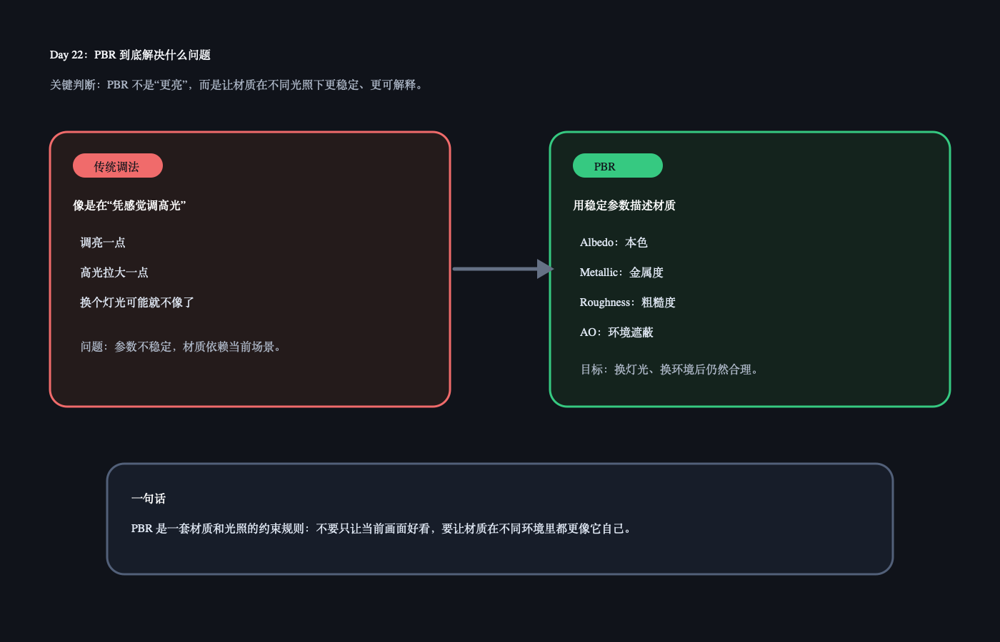

# Day 22：PBR 解决什么问题

今天核心概念：PBR 不是“更高级的高光”，而是一套更稳定的材质反射规则。它让同一个材质换灯光、换环境后，仍然尽量像它自己。

## 今日解释图



## 30 秒记忆

```text
传统调法：常常凭感觉调颜色和高光。
PBR：用更有物理意义的参数描述材质。

PBR 关心：
材质本色是什么？
它是不是金属？
表面粗糙还是光滑？
角落环境光是否被遮住？
```

## Q&A

### Q: PBR 是不是让画面更亮、更真实？

A: 不准确。PBR 的重点不是“更亮”，而是让材质参数更稳定、更可解释。真实感来自材质、光照、环境、色彩空间等一起正确工作。

