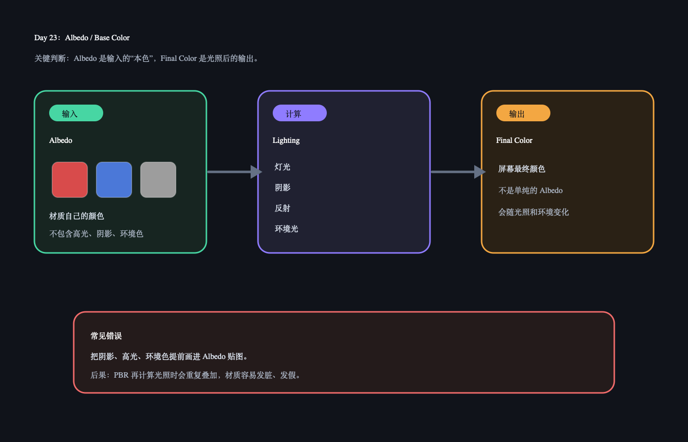

# Day 23：Albedo / Base Color

今天核心概念：`Albedo` 是材质输入的本色，不是屏幕最终颜色。最终颜色还会经过灯光、反射、阴影、环境光等影响。

## 今日解释图



## 30 秒记忆

```text
Albedo = 材质本色。
Final Color = Albedo 被光照、阴影、反射、环境影响后的结果。

Albedo 贴图里不要提前画入阴影和高光。
否则 PBR 再算一次光照时，画面会脏、会假。
```

## Q&A

### Q: Albedo 是不是我最后在屏幕上看到的颜色？

A: 不是。Albedo 是 shader 的输入参数；最终屏幕颜色是光照计算后的输出。

