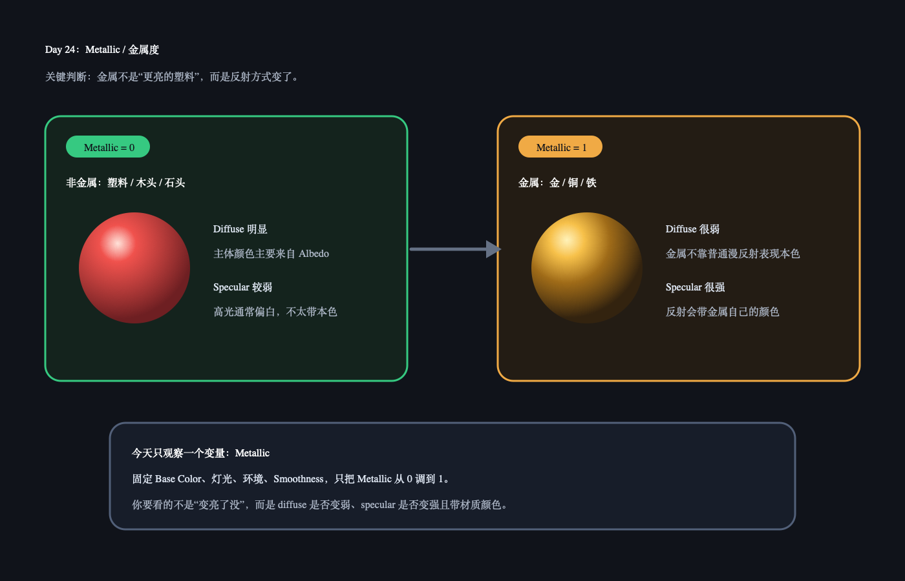

# Day 24：Metallic / 金属度

今天核心概念：`Metallic` 控制材质更像非金属还是金属。它不是简单让材质“更亮”，而是改变光如何被材质分配到 diffuse 和 specular。

## 今日解释图



## 30 秒记忆

```text
Metallic = 0：更像塑料、木头、石头，diffuse 明显。
Metallic = 1：更像金属，diffuse 很弱，specular 强且带材质颜色。
Metallic 半灰：可以观察，但真实材质里很多时候不是最常见状态。
```

## Q&A

### Q: Metallic 是不是让材质更亮？

A: 不是。Metallic 主要改变反射方式：非金属通常有明显的本色漫反射；金属的颜色更多体现在镜面反射里。

