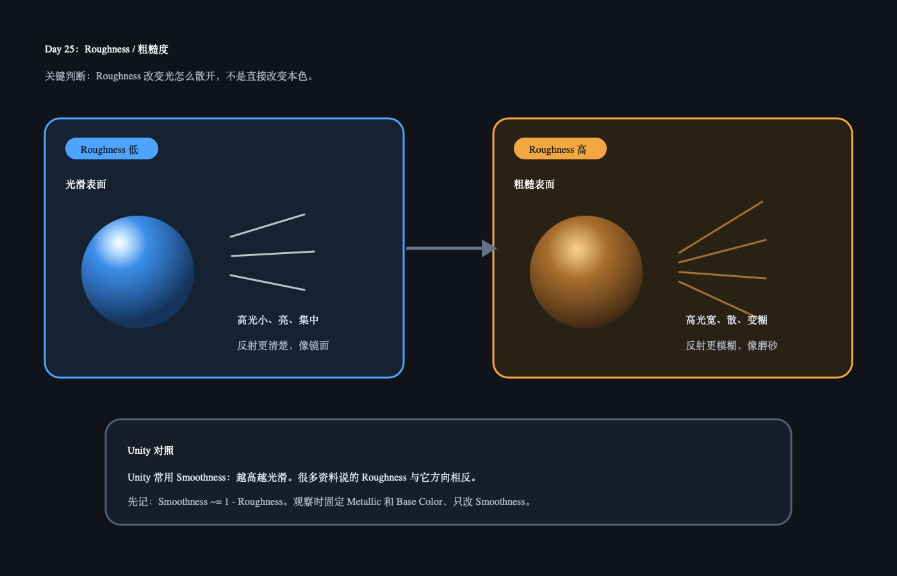

# Day 25：Roughness / 粗糙度

今天核心概念：`Roughness` 描述表面微观上有多粗糙。它主要影响高光宽窄和环境反射清晰度，不是直接改变材质本色。

## 今日解释图



## 30 秒记忆

```text
Roughness 低：表面光滑，高光小而亮，反射清楚。
Roughness 高：表面粗糙，高光宽而散，反射模糊。

Unity 常用 Smoothness：
Smoothness ~= 1 - Roughness
```

## Q&A

### Q: Roughness 是不是让颜色变暗？

A: 不是。Roughness 主要改变光怎么被散开：高光形状、反射清晰度会变；Albedo 本色不应该因为 roughness 直接变色。

