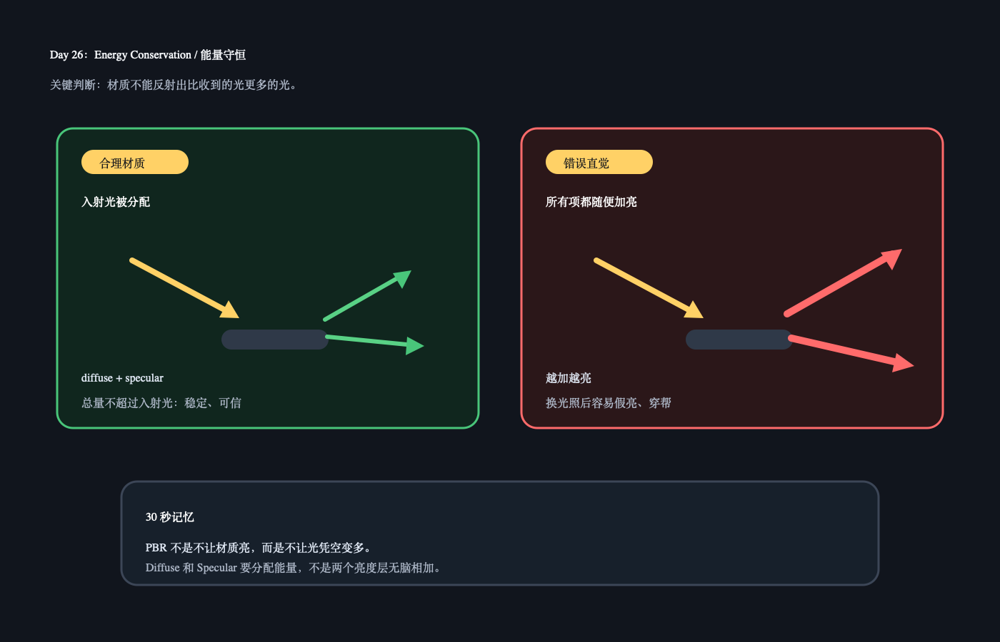

# Day 26：Energy Conservation / 能量守恒

日期：2026-06-13（周六补）

上一天小结：你已经理解 roughness 不是让光变多或变少，而是让反射从“小而亮”变成“大而散”。如果周六没做也没关系，今天只补一个地基概念。

## 今日核心概念

`能量守恒`：材质反射出去的光，不能比接收到的光还多。

PBR 里它的意义不是让你算物理题，而是防止材质参数乱加之后“越照越亮、换场景就崩”。

## 今日解释图



## 学习资料

- SIGGRAPH 2012：`02_hoffman_physics_math_notes.pdf`
  只看和 energy conservation / reflectance 相关的直觉部分，不推公式。
- LearnOpenGL PBR Theory：[PBR/Theory](https://learnopengl.com/PBR/Theory)
  只看 “Energy conservation” 附近的小段。

## 1 小时步骤

1. 先读 10 分钟：只抓一句话，反射不能凭空变多。
2. 在 Unity 找一个 Lit 材质球，固定光照，只改 metallic / smoothness，观察亮度和高光变化。
3. 写 3 句话：什么情况下你感觉材质“假亮”？
4. 把今天的问题补到本 README 的 Q&A。

## 最小输出

能用自己的话说：

```text
PBR 不允许 diffuse 和 specular 无限相加。
如果反射光比入射光还多，材质换光照环境时就会不稳定。
```

## Q&A

### Q：能量守恒是不是说材质不能很亮？

A：不是。亮的材质可以很亮，金属和镜面也可以有强反射。能量守恒说的是：反射出去的总光量不能凭空超过照进来的光量。它限制的是“不合理地乱加亮度”。

