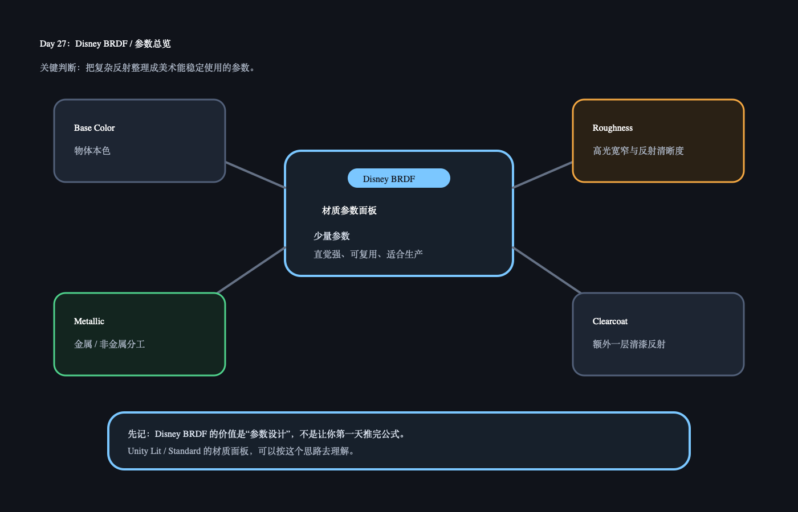

# Day 27：Disney BRDF / 参数总览

日期：2026-06-14（周日补）

上一天小结：能量守恒告诉我们，材质参数不能无限加亮。今天开始看 Disney BRDF，把它当成“现代材质面板背后的设计思想”。

## 今日核心概念

`Disney BRDF` 的重点不是某个公式，而是把复杂材质拆成美术能理解、能稳定调的参数。

## 今日解释图



## 学习资料

- `06_burley_disney_brdf_notes.pdf`
  只看设计目标、base color、metallic、roughness、specular、clearcoat 的说明。
- `06_burley_disney_brdf_slides.pdf`
  只快速看参数图和材质球例子。

## 1 小时步骤

1. 读 15 分钟 Disney BRDF 的参数设计目标。
2. 打开 Unity Lit 材质面板，对照 Base Map / Metallic / Smoothness / Normal / Occlusion。
3. 只选 3 个参数写解释：base color、metallic、roughness。
4. 写 3-5 句话：为什么好参数比复杂公式更适合项目生产？

## 最小输出

能说清：

```text
Disney BRDF 想把复杂的物理反射，整理成美术能稳定使用的一组参数。
```

## Q&A

### Q：Disney BRDF 是不是 Unity PBR 的唯一来源？

A：不是唯一来源，但它影响很大。现代游戏引擎的材质面板和参数设计，都能看到类似思想：参数要少、直觉强、稳定、适合美术生产。

