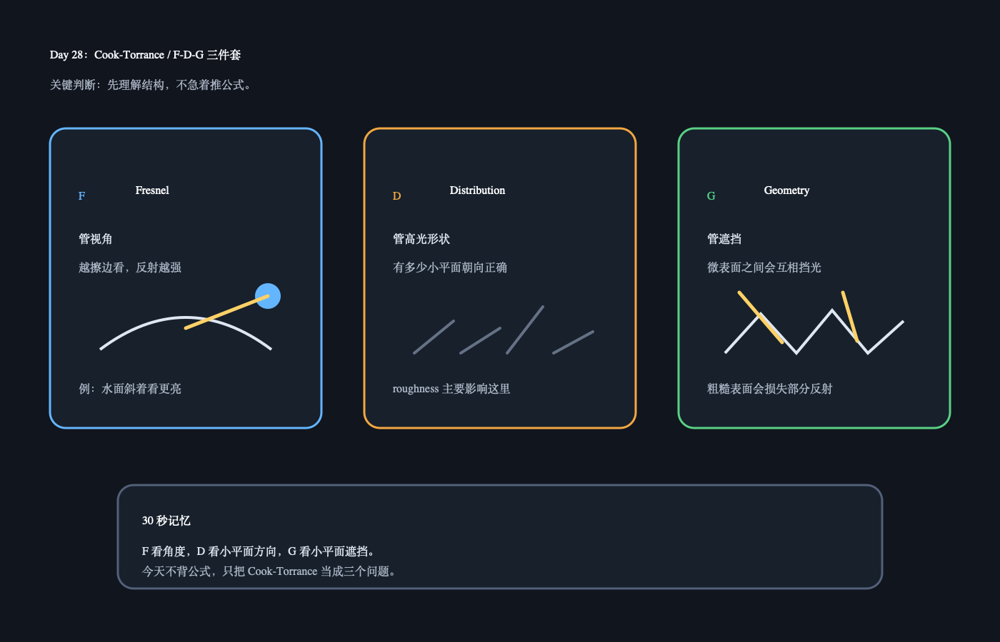

# Day 28：Cook-Torrance / F-D-G 三件套

日期：2026-06-15（今天）

上一天小结：如果周末没看 Disney BRDF，也没关系。你只要先记住：现代 PBR 参数是为了让复杂反射变得可控。今天只看 Cook-Torrance 的结构，不推公式。

## 今日核心概念

Cook-Torrance 的 specular 可以先拆成三块：

```text
F：Fresnel，视角越擦边，反射越强。
D：Distribution，微表面有多少朝向正确方向，决定高光形状。
G：Geometry，微表面之间互相遮挡，决定反射损失。
```

## 今日解释图



## 学习资料

- LearnOpenGL PBR Theory：[PBR/Theory](https://learnopengl.com/PBR/Theory)
  只看 Cook-Torrance BRDF 公式下方对 `D`、`F`、`G` 的解释。
- `06_burley_disney_brdf_notes.pdf`
  只对照 roughness 和 specular 相关说明，不追推导。

## 1 小时步骤

1. 先读 F/D/G 的文字解释，不抄公式。
2. 给每个字母写一句人话解释。
3. 在 Unity 里用一个光滑球和一个粗糙球观察高光形状。
4. 写 3-5 句话：哪个模块最像你最近理解的 roughness？

## 最小输出

能说清：

```text
F 管视角，D 管高光形状，G 管微表面遮挡。
```

## Q&A

### Q：今天需要背 Cook-Torrance 公式吗？

A：不需要。今天只需要把公式看成结构图：它不是一坨数学，而是在问三个问题：角度会不会更反？小镜子朝向对不对？小镜子会不会互相挡住？

### Q：立体角是什么？

A：普通角度是在 2D 平面里描述“张开多大”，比如一个扇形张开 30 度。立体角是在 3D 空间里描述“一个方向范围张开多大”，像你站在球心看向天空时，一小块天空在你眼里占了多大范围。可以先记：角度量一段扇形，立体角量一块锥形视野。PBR / IBL 里经常要在半球方向上采样光线，立体角就是用来描述这些方向范围大小的单位。
