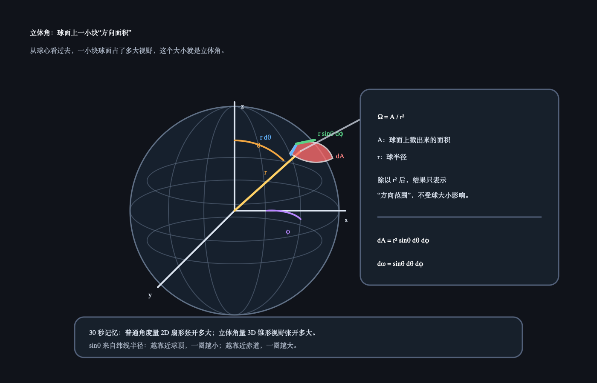

# Day 28：Cook-Torrance / F-D-G 三件套

日期：2026-06-15（今天）

上一天小结：如果周末没看 Disney BRDF，也没关系。你只要先记住：现代 PBR 参数是为了让复杂反射变得可控。今天只看 Cook-Torrance 的结构，不推公式。

## 今日核心概念

Cook-Torrance 的 specular 可以先拆成三块：

```text
F：Fresnel，视角越擦边，反射越强。
D：Distribution，微表面有多少朝向正确方向，决定高光形状。
G：Geometry，微表面之间互相遮挡，决定反射损失。
```

## 今日解释图


## 立体角解释图



## 学习资料

- LearnOpenGL PBR Theory：[PBR/Theory](https://learnopengl.com/PBR/Theory)
  只看 Cook-Torrance BRDF 公式下方对 `D`、`F`、`G` 的解释。
- `06_burley_disney_brdf_notes.pdf`
  只对照 roughness 和 specular 相关说明，不追推导。

## 1 小时步骤

1. 先读 F/D/G 的文字解释，不抄公式。
2. 给每个字母写一句人话解释。
3. 在 Unity 里用一个光滑球和一个粗糙球观察高光形状。
4. 写 3-5 句话：哪个模块最像你最近理解的 roughness？

## 最小输出

能说清：

```text
F 管视角，D 管高光形状，G 管微表面遮挡。
```

## Q&A

### Q：今天需要背 Cook-Torrance 公式吗？

A：不需要。今天只需要把公式看成结构图：它不是一坨数学，而是在问三个问题：角度会不会更反？小镜子朝向对不对？小镜子会不会互相挡住？

### Q：立体角是什么？

A：普通角度是在 2D 平面里描述“张开多大”，比如一个扇形张开 30 度。立体角是在 3D 空间里描述“一个方向范围张开多大”，像你站在球心看向天空时，一小块天空在你眼里占了多大范围。可以先记：角度量一段扇形，立体角量一块锥形视野。PBR / IBL 里经常要在半球方向上采样光线，立体角就是用来描述这些方向范围大小的单位。

### Q：图里的 `Ω = A / r²` 怎么理解？

A：把你放在球心，从球心往外看。某一束方向会在半径为 `r` 的球面上截出一小块面积 `A`，这块面积占得越大，说明这束方向范围越大。为了让结果不受球半径影响，就用 `A / r²` 把半径消掉，这个值就是立体角 `Ω`。所以立体角不是普通面积，而是“从球心看过去，这块球面占了多大视野”。

### Q：为什么微分立体角是 `dω = sinθ dθ dφ`？

A：图里用两个角度定位球面上一小块：`θ` 是从上往下的角度，`φ` 是绕一圈的角度。沿 `θ` 方向走一小步，弧长大约是 `r dθ`；沿 `φ` 方向走一小步，那一圈的半径不是 `r`，而是 `r sinθ`，所以弧长是 `r sinθ dφ`。小面积就是两条边相乘：`dA = r dθ * r sinθ dφ = r² sinθ dθ dφ`。再除以 `r²`，得到 `dω = sinθ dθ dφ`。

### Q：为什么横向边是 `r sinθ dφ`，不是 `r dφ`？

A：因为 `φ` 是“绕竖直轴转一圈”的角度。你所在的高度不同，绕这一圈的小圆半径也不同。靠近北极时，小圆很小；到赤道时，小圆最大。这个小圆半径等于大球半径 `r` 在水平面上的投影，也就是 `r sinθ`。所以横向走一小段的弧长不是 `r dφ`，而是 `r sinθ dφ`。可以记成：`dφ` 负责“转多少”，`r sinθ` 负责“这一圈有多大”。

### Q：为什么这个高度的小圆半径是 `r sinθ`？

A：从球心连到球面上一点，这条线长度是大球半径 `r`。它和竖直方向的夹角是 `θ`。把这条半径投影到水平面上，就得到当前高度那一圈“小圆”的半径。这个投影和 `r`、竖直轴组成一个直角三角形，`θ` 的对边就是水平投影，所以长度是 `r sinθ`。检查两个极端也能记住：`θ = 0` 在北极，`sin0 = 0`，小圆半径为 0；`θ = 90°` 在赤道，`sin90° = 1`，小圆半径就是 `r`。
