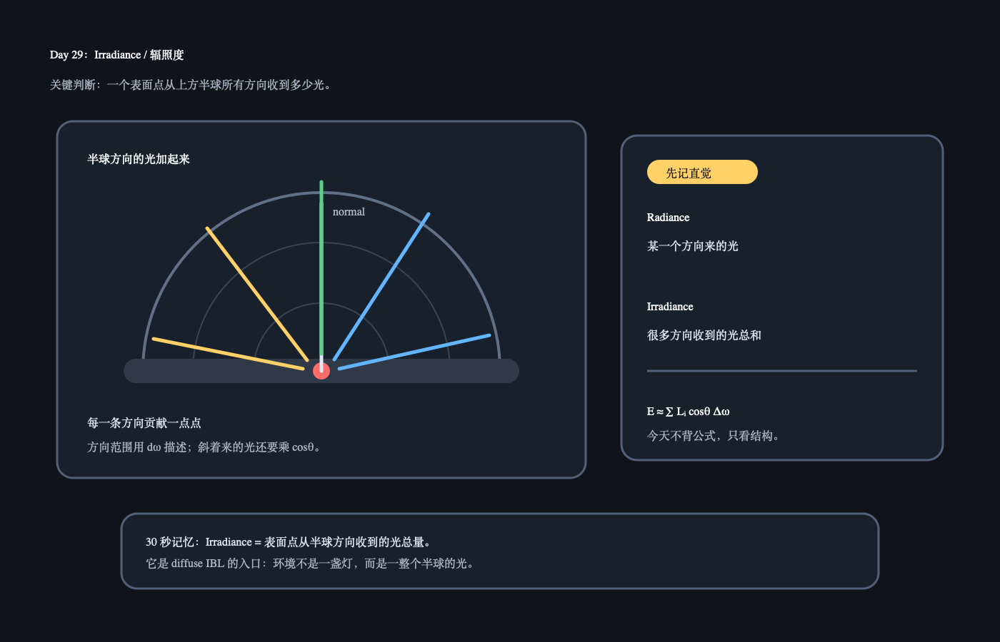

# Day 29：Irradiance / 辐照度

日期：2026-06-16

上一天小结：昨天你追到了立体角、`r sinθ` 和球面积里的 `sinθ` 来源。如果昨天只理解了一半也没关系，今天就把它落到 PBR 里最常见的问题：一个表面点到底从半球方向收到了多少光。

## 今日核心概念

`Irradiance` 可以先理解成：

```text
一个表面点，从它上方半球所有方向收到的光的总和。
```

它是 IBL 里 diffuse 环境光的核心。以后看到“irradiance map”，可以先理解成：提前把环境从各个方向照到表面的 diffuse 光算好、存好。

## 今日解释图



## 学习资料

- LearnOpenGL PBR IBL Diffuse irradiance：[PBR/IBL/Diffuse irradiance](https://learnopengl.com/PBR/IBL/Diffuse-irradiance)
  只看开头到 irradiance convolution 的概念说明，不看代码实现。
- `02_hoffman_physics_math_notes.pdf`
  只回看和半球积分、入射光相关的文字，不追公式细节。

## 1 小时步骤

1. 用 10 分钟复习昨天的 `dω = sinθ dθ dφ`：它是在描述半球上一小块方向范围。
2. 读 LearnOpenGL diffuse irradiance 开头：只抓“环境光来自半球很多方向”。
3. 在 Unity 里找一个有 Skybox 的场景，关掉直接光或减弱直接光，观察材质球仍然能被环境照亮。
4. 写 3-5 句话：环境光为什么不是“一盏灯”，而是“很多方向的光加起来”？

## 最小输出

能说清：

```text
Irradiance 是表面点从半球方向收到的光总量。
Diffuse IBL 会把环境光按半球方向累加，得到比较柔和的环境照明。
```

## Q&A

### Q：Irradiance 和 Radiance 有什么区别？

A：先用很粗的理解：`Radiance` 更像“某一个方向来的光有多强”；`Irradiance` 更像“一个表面点从很多方向总共收到了多少光”。今天先记这个直觉，后面学 IBL 时再细分单位和公式。

### Q：为什么要对半球积分？

A：因为一个表面点只接收它正面半球方向来的光。背面方向的光通常被表面挡住，不会直接照到这个点。所以 diffuse 环境光不是只看一个方向，而是把上方半球很多方向的小贡献加起来。

### Q：为什么斜着来的光贡献会变小？

A：同一束光正面照到表面时，能量比较集中；斜着照时，会摊到更大的表面范围上，所以单位面积收到的光变少。PBR 公式里常见的 `cosθ` 就是在表达这个“越斜贡献越小”的投影关系。

