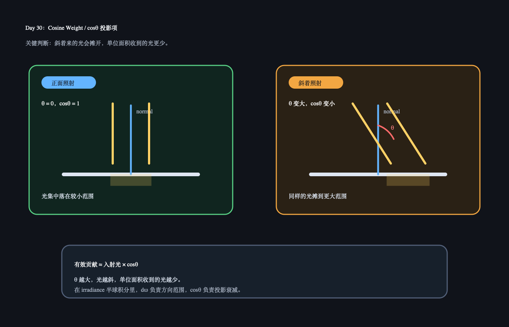

# Day 30：Cosine Weight / 斜射光为什么要乘 cosθ

日期：2026-06-17

上一天小结：Day 29 学的是 `Irradiance`：一个表面点从上方半球很多方向收到的光总量。今天只补一个关键细节：为什么半球里每个方向的光不能直接平均相加，而是要看它和法线的夹角。

## 今日核心概念

`cosθ` 投影项表示：

```text
同样一束光，正面照到表面贡献最大；斜着照到表面会被摊到更大面积上，所以单位面积收到的光变少。
```

在 PBR 里，它经常出现在半球积分里：

```text
irradiance ≈ sum(每个方向来的光 * cosθ * 方向范围)
```

## 今日解释图



## 学习资料

- LearnOpenGL PBR IBL Diffuse irradiance：[PBR/IBL/Diffuse irradiance](https://learnopengl.com/PBR/IBL/Diffuse-irradiance)
  只看 irradiance 积分里 `cos(theta)` 出现的那一小段。
- `02_hoffman_physics_math_notes.pdf`
  只回看投影面积 / 入射角相关直觉，不看完整推导。

## 1 小时步骤

1. 画两束同样宽度的光：一束垂直照射，一束斜着照射。
2. 标出斜射光摊开的面积更大，因此单位面积能量更少。
3. 在 Unity 里用一个平面和一盏 Directional Light，旋转灯光角度，观察表面亮度变化。
4. 写 3-5 句话：为什么“光源强度没变”，表面亮度却变了？

## 最小输出

能说清：

```text
cosθ 不是随便加的系数，它是在表达斜着来的光会被摊开。
θ 越大，cosθ 越小，表面收到的有效光越少。
```

## Q&A

### Q：θ 是哪个角？

A：这里的 `θ` 通常是入射光方向和表面法线之间的夹角。光沿法线正面打下来时，`θ = 0`，`cosθ = 1`，贡献最大。光擦着表面来时，`θ` 接近 90°，`cosθ` 接近 0，贡献很小。

### Q：为什么斜着照会变暗？

A：不是光变少了，而是同样的光被摊到更大的表面范围上。单位面积拿到的能量变少，所以看起来更暗。

### Q：这和立体角有什么关系？

A：立体角 `dω` 描述“某一小块方向范围有多大”；`cosθ` 描述“这个方向的光打到表面有多有效”。半球积分通常两者都要用：方向范围要算，斜射衰减也要算。

