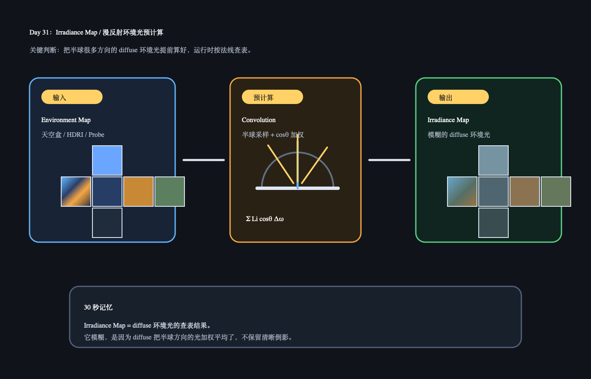

# Day 31：Irradiance Map / 把环境漫反射预计算成贴图

日期：2026-06-18

上一天小结：Day 30 学的是 `cosθ` 投影项：同样的光斜着照会摊到更大面积，所以单位面积收到的光更少。今天把 Day 29 的半球积分和 Day 30 的投影项合起来，看一个工程化结果：`Irradiance Map`。

## 今日核心概念

`Irradiance Map` 可以先理解成：

```text
把环境贴图里“每个方向能给表面带来多少 diffuse 光”提前算好，存成一张很模糊的 cubemap。
```

运行时 shader 不需要每个像素都重新对半球采样很多次，只要根据法线方向查这张 irradiance map，就能得到柔和的 diffuse 环境光。

## 今日解释图



## 学习资料

- LearnOpenGL PBR IBL Diffuse irradiance：[PBR/IBL/Diffuse irradiance](https://learnopengl.com/PBR/IBL/Diffuse-irradiance)
  只看 “Convoluting the HDR environment map” 前后的概念说明，代码先跳过。
- Unity Manual / Lighting：只看 Reflection Probe / Environment Lighting 的概念入口。今天不深挖设置项。

## 1 小时步骤

1. 先复述昨天公式结构：`环境光贡献 ≈ Li * cosθ * dω`。
2. 看 LearnOpenGL 的 diffuse irradiance 图，理解“把环境 cubemap 卷积成 irradiance map”。
3. 在 Unity 里观察：换 Skybox 或 Reflection Probe 后，材质暗部的环境色会变。
4. 写 3-5 句话：为什么 diffuse 环境光看起来柔和、模糊，而不是像镜子一样清楚？

## 最小输出

能说清：

```text
Irradiance map 是 diffuse IBL 的预计算结果。
它把半球很多方向来的环境光提前加权累加，运行时按法线方向查表。
```

## Q&A

### Q：为什么 irradiance map 看起来很模糊？

A：因为 diffuse 反射本来就不保留清晰方向信息。它把半球很多方向的光按 `cosθ` 加起来，结果更像“这个方向附近总体是什么环境色”，而不是“某个物体的清晰倒影”。

### Q：为什么运行时不直接每个像素都算半球积分？

A：太贵。一个像素如果要采很多方向，再乘上 `cosθ` 和 `dω` 累加，成本很高。irradiance map 把这件事提前算好，运行时只查一次贴图，工程上更划算。

### Q：Irradiance map 和 Reflection Probe 是什么关系？

A：可以先粗略理解：Reflection Probe / Skybox 提供环境信息；PBR 管线会从环境信息里生成不同用途的贴图。Diffuse 需要的是模糊的 irradiance，specular 需要的是按 roughness 分级模糊的反射环境。

