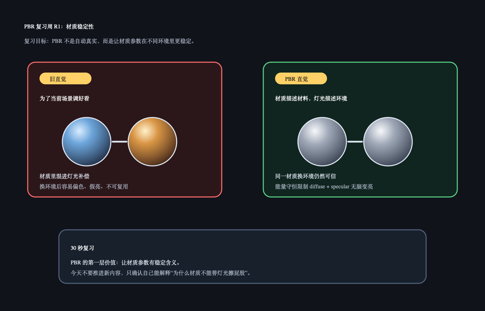

# PBR 复习周 R1：PBR 为什么让材质更稳定

日期：2026-06-23

昨天可能还没有正式开始复习周，所以今天从 R1 开始。今天不讲新内容，只复习两个已经学过的点：

```text
PBR 解决什么问题
Energy Conservation / 能量守恒
```

## 今日核心复习

PBR 不是让画面自动变真实，而是让材质参数更稳定、更可复用。

旧做法容易把“材质本身”和“当前场景灯光补偿”混在一起。PBR 的价值是把这些拆开：材质描述材料，灯光描述环境，shader 按相对稳定的规则把它们组合起来。

## 今日解释图



## 复习资料

- [Day 22：PBR Intro](../day22_pbr_intro/README.md)
  只看 30 秒记忆和 Q&A。
- [Day 26：Energy Conservation](../day26_energy_conservation/README.md)
  只看“材质不能反射出比收到的光更多的光”。

## 1 小时步骤

1. 用 5 分钟复述：PBR 为什么不是“自动真实”。
2. 看 Day 22 和 Day 26 两张图，只抓稳定性和能量守恒。
3. 在 Unity 里用同一个材质球切换两种 Skybox / 灯光，观察材质是否还像同一种材料。
4. 写 3-5 句话：哪里是材质问题，哪里是灯光问题。

## 最小观察目标

在 Unity 里看同一个材质球：

```text
场景 A：偏冷环境光
场景 B：偏暖环境光
```

观察重点不是“哪个更好看”，而是：

```text
同一个材质换环境后，是否仍然像同一种材料？
```

## 3-5 句话复习笔记模板

```markdown
今天复习的是：

我现在理解 PBR 不是：

PBR 真正在解决：

能量守恒让我记住：

我还不确定的问题：
```

## Q&A

### Q：PBR 是不是等于写实？

A：不是。PBR 是一套更稳定的材质和光照规则。你仍然可以做写实、卡通或风格化，但材质参数最好不要偷偷替某个场景的灯光擦屁股。

### Q：能量守恒和材质稳定有什么关系？

A：如果 diffuse 和 specular 可以随便加亮，材质在一个场景里可能好看，但换光照后就容易假亮。能量守恒给材质反射一个上限，让它在不同环境里更不容易崩。

### Q：今天要不要继续学新公式？

A：不要。本周只复习。今天能把“PBR 是稳定规则，不是自动真实”说顺，就够了。

