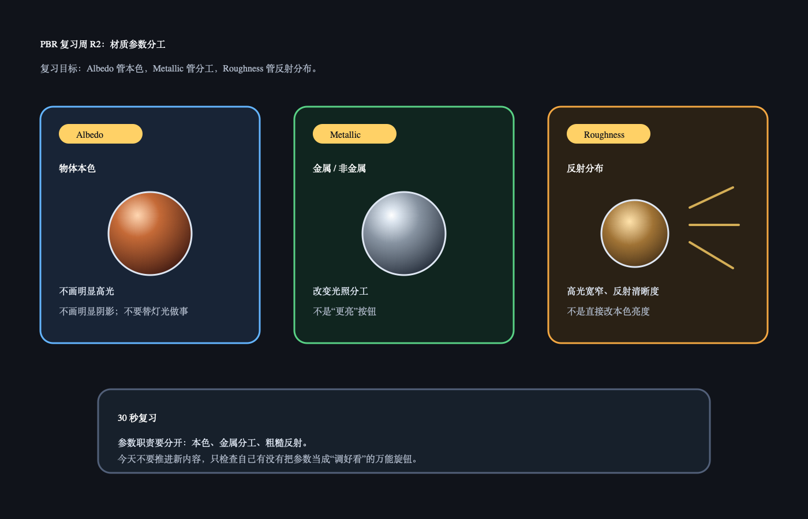

# PBR 复习周 R2：Albedo / Metallic / Roughness

日期：2026-06-24

上一天 R1 复习的是：PBR 的第一层价值是让材质参数更稳定，而不是自动让画面真实。今天不讲新内容，只复习三个已经学过的材质参数：

```text
Albedo / Base Color
Metallic
Roughness
```

## 今日核心复习

这三个参数要分工清楚：

```text
Albedo：物体本色，不包含明显光照。
Metallic：决定金属 / 非金属的光照分工。
Roughness：决定高光集中程度和反射清晰度。
```

如果这三个参数混着用，比如把阴影画进 albedo、用 metallic 当亮度按钮、用 roughness 乱补画面明暗，材质就会在换灯光或换环境时变得不稳定。

## 今日解释图



## 复习资料

- [Day 23：PBR Albedo](../../day23_albedo/README.md)
  只看 30 秒记忆和 Q&A。
- [Day 24：PBR Metallic](../../day24_metallic/README.md) 与 [Day 25：PBR Roughness](../../day25_roughness/README.md)
  只看解释图和 30 秒记忆。

## 1 小时步骤

1. 用 5 分钟分别用一句话解释 albedo、metallic、roughness。
2. 看 Day 23-25 三张图，检查自己有没有把参数职责混在一起。
3. 在 Unity 里做或观察一个 3x3 材质球矩阵：横轴 roughness，纵轴 metallic。
4. 写 3-5 句话：哪个参数最容易被误用，为什么。

## 最小 Unity 观察目标

固定同一个 base color，只改变：

```text
横轴：roughness / smoothness
纵轴：metallic
```

观察：

```text
Metallic 改变金属和非金属的反射分工。
Roughness 改变高光和反射清晰度。
Base Color 不应该承担灯光效果。
```

## 3-5 句话复习笔记模板

```markdown
今天复习的是：

Albedo 我现在理解为：

Metallic 我现在理解为：

Roughness 我现在理解为：

我最容易混淆的是：
```

## Q&A

### Q：Albedo 为什么不能画明显阴影和高光？

A：Albedo 表示材料本色。如果把光照画进去，真实灯光再照一次时，相当于重复叠加光照效果。换环境后，这种材质很容易脏、假亮或偏色。

### Q：Metallic 是不是让东西更亮？

A：不是。Metallic 改变的是光照分工：非金属通常有明显 diffuse，本色主要在 diffuse 里；金属 diffuse 很弱，本色更多体现在 specular 反射里。

### Q：Roughness 是不是让颜色变暗？

A：不是。Roughness 主要改变反射分布。低 roughness 高光小而亮、反射清楚；高 roughness 高光大而散、反射模糊。它不是直接改本色的亮度旋钮。

