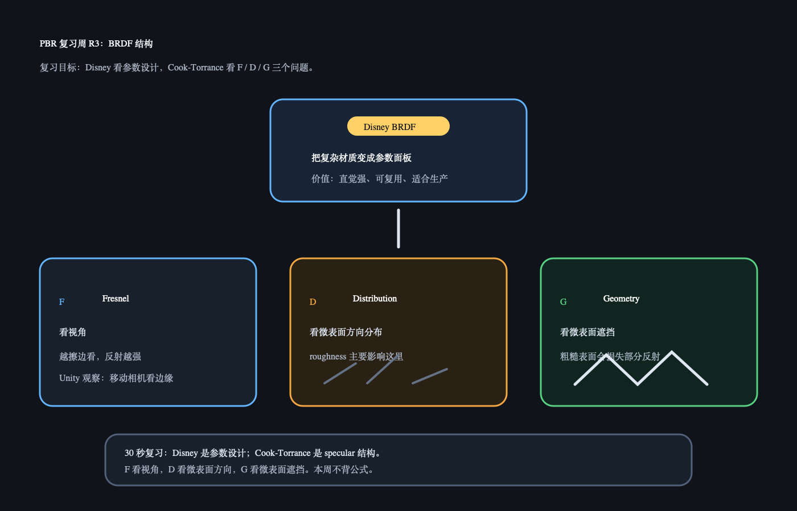

# PBR 复习周 R3：BRDF 结构

日期：2026-06-25

上一天 R2 复习的是材质参数分工：`Albedo` 管本色，`Metallic` 管金属/非金属分工，`Roughness` 管高光和反射清晰度。今天不讲新内容，只复习 BRDF 结构。

## 今日核心复习

今天只需要把两件事说顺：

```text
Disney BRDF：重点是把复杂材质整理成美术能用的参数。
Cook-Torrance：重点是把 specular 拆成 F、D、G 三个问题。
```

F / D / G 先按人话记：

```text
F：Fresnel，看视角。越擦边看，反射越强。
D：Distribution，看微表面方向分布。roughness 主要影响这里。
G：Geometry，看微表面遮挡。粗糙表面会损失部分反射。
```

## 今日解释图



## 复习资料

- [Day 27：Disney BRDF](../../day27_disney_brdf/README.md)
  只看解释图和 30 秒记忆。
- [Day 28：Cook-Torrance / F-D-G](../../day28_cook_torrance/README.md)
  只看 F / D / G 的定义，不看立体角部分。

## 1 小时步骤

1. 用 5 分钟复述：Disney BRDF 的价值为什么是“参数设计”。
2. 用 10 分钟复述 F / D / G，每个只说一句人话。
3. 在 Unity 里固定材质和灯光，移动视角，观察边缘反射是否更明显。
4. 写 3-5 句话：F / D / G 里哪个最容易和 roughness 对上。

## 最小 Unity 观察目标

固定一个较光滑的材质球：

```text
只移动相机视角
不要改灯光
不要改材质参数
```

观察：

```text
边缘 / 擦边视角的反射是否更明显。
```

这个观察对应 `Fresnel / F`。

## 3-5 句话复习笔记模板

```markdown
今天复习的是：

Disney BRDF 我现在理解为：

F 负责：

D 负责：

G 负责：
```

## Q&A

### Q：Disney BRDF 和 Cook-Torrance 是同一件事吗？

A：不是完全同一层。Disney BRDF 更强调一套适合生产的材质参数设计；Cook-Torrance 更像 specular 反射的一种结构化模型。学习时可以先把 Disney 看成“参数面板思想”，把 Cook-Torrance 看成“高光/反射结构”。

### Q：F / D / G 要背公式吗？

A：本周复习不背公式。先做到能解释它们各自管什么。公式以后再看时，才知道每一块为什么存在。

### Q：Roughness 主要对应 F / D / G 哪一块？

A：最直接对应 `D / Distribution`，因为 roughness 描述微表面方向分布有多散。它也会间接影响整体 specular 观感，但先把它和 D 绑定起来最容易记。

