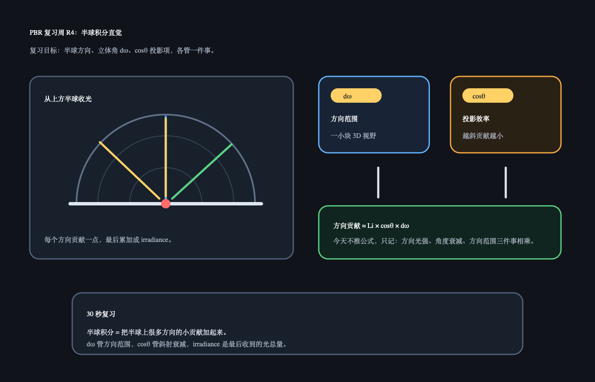

# PBR 复习周 R4：半球积分直觉

日期：2026-06-26

上一天 R3 复习的是 BRDF 结构：Disney BRDF 看参数设计，Cook-Torrance 看 F / D / G。今天不讲新内容，只复习半球积分的直觉，把之前问过的立体角、`Irradiance` 和 `cosθ` 串起来。

## 今日核心复习

半球积分先不用当公式看，可以当成三个问题：

```text
1. 从哪些方向收光？       -> 上方半球
2. 每一小块方向有多大？   -> 立体角 dω
3. 这个方向贡献有多有效？ -> cosθ 投影项
```

所以 diffuse 环境光的直觉是：

```text
把上方半球很多方向来的光，按方向范围和斜射衰减加起来。
```

## 今日解释图



## 复习资料

- [Day 28：Cook-Torrance / 立体角](../../day28_cook_torrance/README.md)
  只看立体角、`dω = sinθ dθ dφ`、`r sinθ` 的 Q&A。
- [Day 29：Irradiance](../../day29_irradiance/README.md) 与 [Day 30：cosθ 投影项](../../day30_cosine_weight/README.md)
  只看解释图和 30 秒记忆。

## 1 小时步骤

1. 先用一句话解释立体角：3D 方向范围。
2. 再用一句话解释 irradiance：表面点从半球方向收到的光总量。
3. 最后用一句话解释 `cosθ`：斜着来的光被摊开，单位面积贡献变小。
4. 在 Unity 里旋转 Directional Light 照平面，观察亮度随角度变化。

## 最小 Unity 观察目标

场景只需要：

```text
一个平面
一个 Directional Light
一个固定相机
```

观察：

```text
灯光越正对平面，表面越亮。
灯光越斜，表面越暗。
```

这就是 `cosθ` 投影项的可见结果。

## 3-5 句话复习笔记模板

```markdown
今天复习的是：

立体角我现在理解为：

Irradiance 我现在理解为：

cosθ 我现在理解为：

我还容易卡住的是：
```

## Q&A

### Q：半球积分是不是一定要先懂微积分？

A：当前阶段不用。先把它理解成“把很多方向的小贡献加起来”。微积分只是更精确地描述“很多很多小方向”的累加。

### Q：为什么只看上方半球？

A：因为一个表面点通常只接收法线朝向那一侧来的光。背面半球的光被表面挡住，对这个点的直接照明贡献可以先不考虑。

### Q：立体角和 cosθ 是不是一回事？

A：不是。`dω` 描述方向范围有多大；`cosθ` 描述这个方向来的光打到表面有多有效。半球积分里这两个因素经常一起出现。

