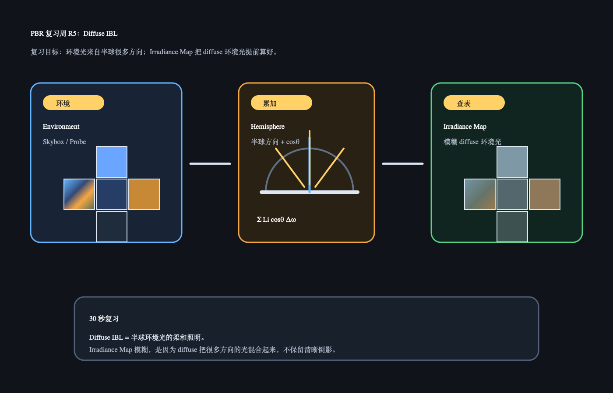

# PBR 复习周 R5：Diffuse IBL / Irradiance Map

日期：2026-06-30

上一轮 R4 复习的是半球积分直觉：`dω` 管方向范围，`cosθ` 管斜射衰减，`irradiance` 是表面点最终收到的光总量。今天补齐复习周最后一项：Diffuse IBL 和 Irradiance Map。

## 今日核心复习

Diffuse IBL 的直觉是：

```text
环境不是一盏灯，而是整个半球很多方向的光。
Diffuse 环境光会把这些方向的光加权累加，得到柔和、模糊的照明。
```

Irradiance Map 的直觉是：

```text
把 diffuse 环境光的半球累加提前算好，运行时按 normal 方向查表。
```

## 今日解释图



## 复习资料

- [Day 29：Irradiance](../../day29_irradiance/README.md)
  只看解释图和 30 秒记忆。
- [Day 31：Irradiance Map](../../day31_irradiance_map/README.md)
  只看“预计算”和 Q&A。

## 1 小时步骤

1. 用一句话解释 irradiance：表面点从半球方向收到的光总量。
2. 用一句话解释 irradiance map：把 diffuse 环境光提前算好的一张查表贴图。
3. 在 Unity 里切换 Skybox / Reflection Probe，观察阴影或暗部环境色变化。
4. 写 3-5 句话：为什么 diffuse IBL 是模糊的，不像镜面反射那样清楚。

## 最小 Unity 观察目标

场景只需要：

```text
一个材质球
一个 Skybox 或 Reflection Probe
一个较弱的主光
```

观察：

```text
换环境后，材质暗部颜色会跟着环境变化。
Diffuse IBL 不是清晰倒影，而是柔和的环境照明。
```

## 3-5 句话复习笔记模板

```markdown
今天复习的是：

Irradiance 我现在理解为：

Irradiance Map 我现在理解为：

Diffuse IBL 为什么模糊：

我还不确定的问题：
```

## Q&A

### Q：Diffuse IBL 为什么是模糊的？

A：因为 diffuse 反射会把半球很多方向的光混合起来。它关心“周围环境总体给这个表面多少光”，不保留某个物体的清晰轮廓。

### Q：Irradiance Map 为什么要提前算？

A：运行时每个像素都采样半球很多方向会很贵。Irradiance Map 把这件事提前做完，shader 只需要按 normal 查一次或少量次数。

### Q：Irradiance Map 和镜面环境反射有什么区别？

A：Irradiance Map 给 diffuse 用，所以很模糊；镜面环境反射给 specular 用，会根据 roughness 保留不同程度的清晰反射。这里不展开新内容，只先记住 diffuse 和 specular 查环境的需求不同。

