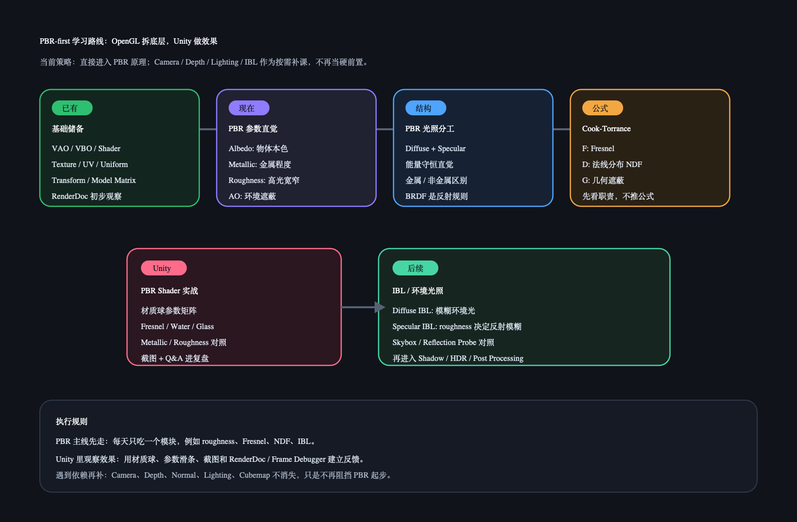
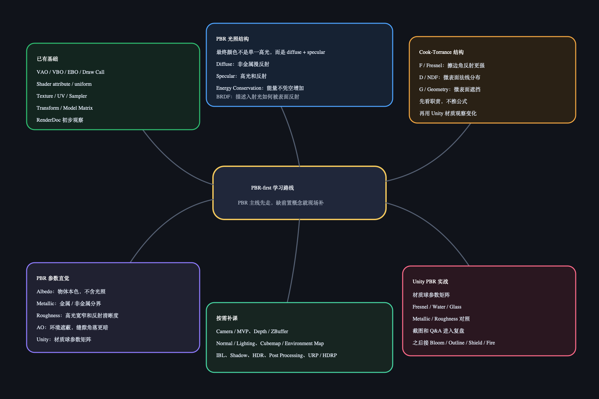

# OpenGL 学习路线图

这里放整体学习计划图，不归到某一天复盘里。

## 当前路线



- [可编辑 SVG 源文件](opengl-learning-roadmap.svg)

## 脑图版本



- [Mermaid 脑图源码](opengl-learning-mindmap.md)
- [可编辑 SVG 脑图](opengl-learning-mindmap.svg)

## 阶段计划

当前采用 PBR-first 加速路线：

- 直接从 PBR 原理开始。
- Camera、Depth、Lighting、Cubemap 作为按需补课，不再作为硬前置。
- Shader 效果实战继续在 Unity 里写。

PBR-first 主线：

| 阶段 | 主题 | 最小产出 |
|------|------|----------|
| PBR 01 | PBR 解决什么问题 | 能解释为什么传统 Blinn-Phong 不够统一 |
| PBR 02 | Albedo / Metallic / Roughness / AO | Unity 做材质球参数矩阵 |
| PBR 03 | Diffuse / Specular / 能量守恒 | 能解释金属和非金属反射差异 |
| PBR 04 | Cook-Torrance 结构 | 只看 F / D / G 各自职责 |
| PBR 05 | Fresnel | Unity 做擦边反射观察 |
| PBR 06 | IBL / Environment | 金属球反射 skybox |
| PBR 07 | PBR 周总结 | 一张 PBR 参数和公式结构脑图 |

原完整路线保留为补课地图：

- OpenGL 线：理解底层管线、状态、矩阵、光照、材质。
- Unity Shader 线：Shader 效果实战都在 Unity 里写，方便沉淀成项目可复用效果。

| 阶段 | 主题 | 最小产出 |
|------|------|----------|
| 第 1 周 | OpenGL 基础管线 | 跑通三角形，看懂 VAO / VBO / Shader / Draw Call |
| 第 2 周 | Texture / UV | 画出带贴图矩形，理解 UV、Sampler、Wrapping、Filtering |
| 第 3 周 | Transform / Model Matrix | 对应 Unity position / rotation / scale |
| 第 4 周 | Camera / MVP + Unity UV 效果 | 画 3D cube；Unity 写 UV 滚动 / 扭曲 / Mask |
| 第 5 周 | Depth / 3D 空间 + Unity 边缘效果 | 多物体遮挡；Unity 写 Outline / Highlight |
| 第 6 周 | Lighting + Unity 光照效果 | 基础明暗；Unity 写 Rim / Toon / MatCap |
| 第 7 周 | Material / 小场景 + Unity 材质效果 | 小场景整合；Unity 写 NormalMap / Dissolve / Flow |
| 第 8-9 周 | PBR 入口 + Unity PBR 效果 | Cubemap / Environment 后进入 PBR；Unity 写 Fresnel / Water / Glass |

## PBR 之后

| 阶段 | 主题 | Unity 实战 |
|------|------|------------|
| 第 10 周 | IBL / 环境光照 | 金属反射、Reflection Probe 对照 |
| 第 11 周 | Shadow / 阴影 | 阴影偏移、软阴影观察 |
| 第 12 周 | HDR / Tone Mapping | Bloom、曝光、线性空间对照 |
| 第 13 周 | Post Processing | Blur、Edge Detection、Fullscreen Effect |
| 第 14 周 | Deferred Rendering | GBuffer、多光源观察 |
| 第 15 周 | Transparent / Blending | Glass、Shield、Fire |
| 第 16 周 | 性能 / GPU 调试 | Instancing、Overdraw、Frame Debugger |
| 第 17 周以后 | URP / HDRP 对照 | RenderFeature、Pass、Shader Graph 生成代码 |

## PBR 时间判断

当前判断：现在直接开始。

原本的第 55-65 天是保守路线。现在切到 PBR-first 后，依赖项按需补：`Camera / Depth / Normal / Lighting / Material / Texture / Environment Map`。

## 一句话版本

```text
直接进入 PBR 原理；OpenGL 负责拆底层，Unity 负责写 Shader 效果，缺哪个前置概念就当场补哪个。
```
