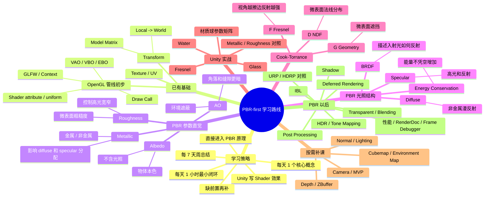

# OpenGL / Unity Shader 学习脑图

```mermaid
mindmap
  root((PBR-first 学习路线))
    学习策略
      每天 1 个核心概念
      每天 1 小时最小闭环
      每 7 天周总结
      直接进入 PBR 原理
      Unity 写 Shader 效果
      缺前置再补
    已有基础
      OpenGL 管线初步
        GLFW / Context
        VAO / VBO / EBO
        Shader attribute / uniform
        Draw Call
      Transform
        Model Matrix
        Local -> World
      Texture / UV
    PBR 参数直觉
      Albedo
        物体本色
        不含光照
      Metallic
        金属 / 非金属
        影响 diffuse 和 specular 分配
      Roughness
        微表面粗糙度
        控制高光宽窄
      AO
        环境遮蔽
        角落和缝隙更暗
    PBR 光照结构
      Diffuse
        非金属漫反射
      Specular
        高光和反射
      Energy Conservation
        能量不凭空增加
      BRDF
        描述入射光如何反射
    Cook-Torrance
      F Fresnel
        视角越擦边反射越强
      D NDF
        微表面法线分布
      G Geometry
        微表面遮挡
    Unity 实战
      材质球参数矩阵
      Fresnel
      Water
      Glass
      Metallic / Roughness 对照
    按需补课
      Camera / MVP
      Depth / ZBuffer
      Normal / Lighting
      Cubemap / Environment Map
    PBR 以后
      IBL
      Shadow
      HDR / Tone Mapping
      Post Processing
      Deferred Rendering
      Transparent / Blending
      性能 / RenderDoc / Frame Debugger
      URP / HDRP 对照
```
