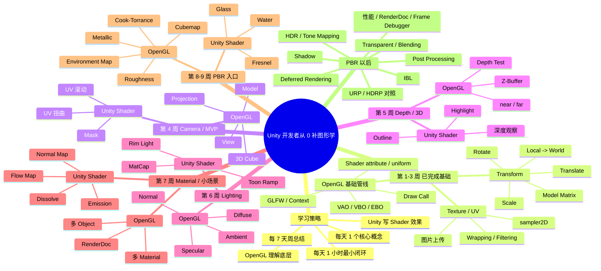

# OpenGL / Unity Shader 学习脑图

```mermaid
mindmap
  root((Unity 开发者从 0 补图形学))
    学习策略
      每天 1 个核心概念
      每天 1 小时最小闭环
      每 7 天周总结
      OpenGL 理解底层
      Unity 写 Shader 效果
    第 1-3 周 已完成基础
      OpenGL 基础管线
        GLFW / Context
        VAO / VBO / EBO
        Shader attribute / uniform
        Draw Call
      Texture / UV
        图片上传
        sampler2D
        Wrapping / Filtering
      Transform
        Translate
        Rotate
        Scale
        Model Matrix
        Local -> World
    第 4 周 Camera / MVP
      OpenGL
        Model
        View
        Projection
        3D Cube
      Unity Shader
        UV 滚动
        UV 扭曲
        Mask
    第 5 周 Depth / 3D
      OpenGL
        Depth Test
        Z-Buffer
        near / far
      Unity Shader
        Outline
        Highlight
        深度观察
    第 6 周 Lighting
      OpenGL
        Normal
        Ambient
        Diffuse
        Specular
      Unity Shader
        Rim Light
        Toon Ramp
        MatCap
    第 7 周 Material / 小场景
      OpenGL
        多 Object
        多 Material
        RenderDoc
      Unity Shader
        Normal Map
        Emission
        Dissolve
        Flow Map
    第 8-9 周 PBR 入口
      OpenGL
        Cubemap
        Environment Map
        Metallic
        Roughness
        Cook-Torrance
      Unity Shader
        Fresnel
        Water
        Glass
    PBR 以后
      IBL
      Shadow
      HDR / Tone Mapping
      Post Processing
      Deferred Rendering
      Transparent / Blending
      性能 / RenderDoc / Frame Debugger
      URP / HDRP 对照
```
